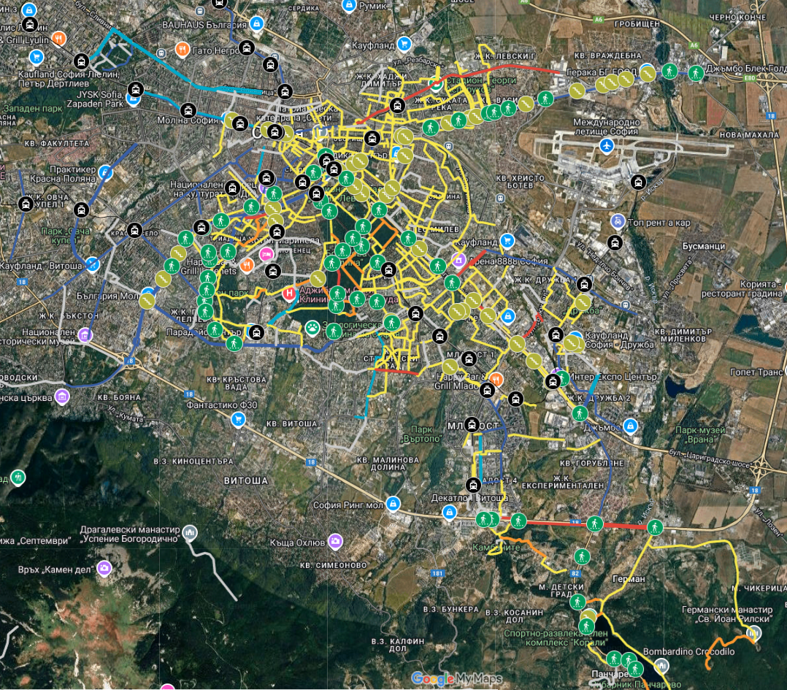
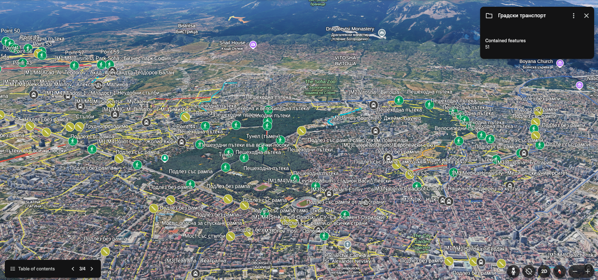

# 🛠 A work in progress 🛠 Velosofize

[**🇧🇬За версия на български натиснете тук.🇧🇬**](Readme.md)

**Table of contents:**

- [🛠 A work in progress 🛠 Velosofize](#-a-work-in-progress--velosofize)
  - [The maps](#the-maps)
    - [Personal edition](#personal-edition)
    - [Collaborative edition](#collaborative-edition)
  - [What's the point of this project?](#whats-the-point-of-this-project)
    - [Concept](#concept)
    - [Free, user-friendly and accountable](#free-user-friendly-and-accountable)
  - [Laws and rulebooks](#laws-and-rulebooks)
  - [Limitations](#limitations)
  - [Alternatives](#alternatives)
    - [CyclOSM](#cyclosm)
    - [Strava heatmap](#strava-heatmap)
    - [Komoot](#komoot)
  - [Useful links](#useful-links)

## The maps

### Personal edition

[Google My maps](https://www.google.com/maps/d/u/0/edit?mid=13Ke06MOSLTuBBbr2ITKNV7kLhs_v2Qc&usp=sharing)\
[Google Earth](https://earth.google.com/web/@42.68536362,23.34252187,551.21893103a,13559.28278408d,35y,-0h,0t,0r/data=CgRCAggBMigKJgokCiAxM0tlMDZNT1NMVHVCQmJyMklUS05WN2tMaHNfdjJRYyACOgMKATBCAggASggI3rfSkgMQAQ)

**Interactive map**:
<iframe src="https://www.google.com/maps/d/u/0/embed?mid=13Ke06MOSLTuBBbr2ITKNV7kLhs_v2Qc&ehbc=2E312F" width="500" height="600"></iframe>

### Collaborative edition

## What's the point of this project?

### Concept

While well-connected, bike-friendly public infrastructure is something built over many years, information infrastructure created and popularized by regular citizens about the safe and convenient paths in the existing infrastructure can be the extra help needed for somebody to decide to plan a route to work or into nature.

It may also encourage somebody to just hang out with their bike and explore their town.

Apart from the obvious and immediate quality-of-life improvement on an individual level stemming from cycling, the grassroots popularization of cycling is also crucial for the realization of the long-term wish and demand by many of us to finally enjoy safe dedicated infrastructure, without the needless tension created between cyclists, pedestrians and drivers, as we inevitably get in each other's way due to the current circumstances on the road in the bidgger cities.

### Free, user-friendly and accountable

This project is aimed at being easily usable on some of the most common software that most Bulgarians already have on their phones, so as to leave little barrier of entry - Google Maps, as well as to be available in other file formats for ease of use on other platforms as well.

## Laws and rulebooks

This section is only available in the Bulgarian version for now. [Click here](Readme.md#закони-и-правилници).

[Railway transportation of bicycles](https://www.bdz.bg/en/a/transportation-of-bicycles)

## Limitations

-

## Alternatives

Considering the low coverage of bike infrastructure online and the [Readme_en.md#limitations] 

### CyclOSM

[CyclOSM](cyclosm.org) is based on the data of an open-source project called [OpenStreetMap](openstreetmap.org) and seems to have the best coverage of official bike lanes in Bulgaria and international routes. It is, however, **not** accessible thorugh Google's various services and is therefore not equivalent to the goals of this current project, which aims to be as widely available as possible on software that most Bulgarian mobile users already have and understand. Furthermore, it doesn't seem to support satellite imagery, Street and 3D view, which are very helpful when planning a route.
CyclOSM focuses on a **more objective approach to cycling routes**, as it aims to document existing dedicated infrastructure and not reflect subjective opinions of contributors.

> "It aims at providing a beautiful and practical map for cyclists, no matter their cycling habits or abilities.
>In urban areas, it renders the main different types of cycle tracks and lanes, on each side of the road, for helping you draw your bike to work route. It also features essential POIs as well as bicycle parking spots or spots shared with motorbikes, specific infrastructure (elevators / ramps), road speeds or surfaces to avoid streets with pavings, bumpers and bike boxes, etc.\
> The map is available by default in the following smartphone applications:\
> [OSMAnd](https://osmand.net/), [All-In-One Offline Maps](https://play.google.com/store/apps/details?id=net.psyberia.offlinemaps) or [AlpineQuest Rando GPS](https://alpinequest.net/) and [OpenMultiMaps](https://framagit.org/tom79/openmaps)"

### Strava heatmap

[Strava](https://www.strava.com/maps/global-heatmap?sport=Ride&style=standard&terrain=false&labels=true&poi=true&cPhotos=true&gColor=mobileblue&gOpacity=100#7.64/42.856/25.244) is a great alternative, given their huge amount of data collected from users tracking or uploading their workout routes through the app. The trajectories of all the users who've passed through a particular location are overlaid to highlight given roads, lanes, etc. This lets everyone "vote" for given routes without the need to manually input or rate them. Routes that one wouldn't have discovered by chance quickly become apparent.
The following locations are also visible on their map:

- Bike lanes
- Public water fountains
- Bicycle parts and repair shops

The downside is that, in my opinion, there is a certain bias in favor of major boulevards, which are often neither safer, nor more convenient, nor more pleasant to ride on than the quiet neighborhood streets running in parallel, but are the obvious choice for passing riders who don't know the area well or for very advanced/brave cyclists.
Also, many of its features are paid (heatmap is free to use, albeit with ever increasing restrictions).

### Komoot

-

## Useful links

