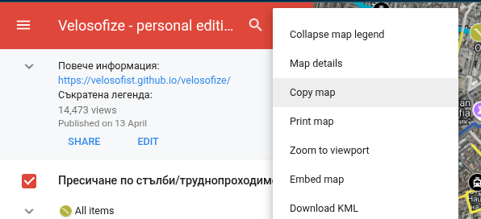

# 🛠 A work in progress - Velosofize

[**🇧🇬 За версия на български натиснете тук. 🇧🇬**](Readme.md)

**Table of contents:**

- [🛠 A work in progress - Velosofize](#-a-work-in-progress---velosofize)
  - [The maps](#the-maps)
      - [Google Maps (2D)](#google-maps-2d)
      - [Legend](#legend)
        - [Route Categories](#route-categories)
        - [Location Categories](#location-categories)
      - [Google Earth (3D)](#google-earth-3d)
    - [Collaborative edition](#collaborative-edition)
  - [What's the goal of this project?](#whats-the-goal-of-this-project)
    - [Grass-roots](#grass-roots)
    - [Free in the long-term and sustainable](#free-in-the-long-term-and-sustainable)
    - [Platform-independent](#platform-independent)
    - [User-friendly](#user-friendly)
    - [Accountable](#accountable)
  - [Laws and rulebooks](#laws-and-rulebooks)
    - [Road traffic act](#road-traffic-act)
  - [Other useful projects and apps](#other-useful-projects-and-apps)
    - [CyclOSM](#cyclosm)
    - [Strava heatmap](#strava-heatmap)
    - [Komoot](#komoot)
    - [Copy the map for personal edits](#copy-the-map-for-personal-edits)

## The maps

#### [Google Maps (2D)](https://www.google.com/maps/d/u/0/edit?mid=13Ke06MOSLTuBBbr2ITKNV7kLhs_v2Qc&usp=sharing)

**Interactive map**:
<iframe src="https://www.google.com/maps/d/u/0/embed?mid=13Ke06MOSLTuBBbr2ITKNV7kLhs_v2Qc&ehbc=2E312F" width="500" height="600"></iframe>

#### Legend 

##### Route Categories

1. 🔵 Bike lanes
1. 🔵 Bike lanes (not separated from traffic)
1. 🟡 "Convenient" - Relatively comfortable and safe streets and shared areas
1. 🟠 Unpaved or difficult to traverse
1. 🟣 Wide or unused sidewalks
1. ⚪ Unexplored

##### Location Categories

- 🚉 Public transport 🚉
- 🚶‍♂️🚲 Crossing points on certain major boulevards 🚲🚶‍♂️

#### [Google Earth (3D)](https://earth.google.com/web/@42.68536362,23.34252187,551.21893103a,13559.28278408d,35y,-0h,0t,0r/data=CgRCAggBMigKJgokCiAxM0tlMDZNT1NMVHVCQmJyMklUS05WN2tMaHNfdjJRYyACOgMKATBCAggASggI3rfSkgMQAQ)

### Collaborative edition

* Contribute in Github - Also see the [for contributors](for_contributors/Readme.md) page.
* Also see [the alternatives](https://github.com/velosofist/velosofize/tree/main/for_contributors) - other projects worth contributing to.

## What's the goal of this project?

### Grass-roots

While well-connected, bike-friendly public infrastructure is something built over many years, information infrastructure created and popularized by regular citizens about the safe and convenient paths in the existing infrastructure can be the extra help needed for somebody to decide to plan a route to work or into nature.

It may also encourage somebody to just hang out with their bike and explore their town.

Apart from the obvious and immediate quality-of-life improvement on an individual level stemming from cycling, the grassroots popularization of cycling is also crucial for the realization of the long-term wish and demand by many of us to finally enjoy safe dedicated infrastructure, without the needless tension created between cyclists, pedestrians and drivers, as we inevitably get in each other's way due to the current circumstances on the road in the bigger cities.

### Free in the long-term and sustainable

Principles used in open-source software, such as [community contributions, version control, and forking](https://www.geeksforgeeks.org/introduction-to-open-source-and-its-benefits/) ensure that collaborative work can continue even if the creator of the project stops contributing and maintaining it — unlike a service which may be put behind a paywall or deprecated at any point (such as [Strava](Readme_en.md#Strava), anybody or any group of contributors can create a "fork" - their own copy of the project (Github Pages website, Google My maps map, etc.) and keep it accessible and maintained for other users or for personal use.

### Platform-independent

Availability in different file formats (keeping multiple different representations of the collected data) makes up for ease of use on other platforms if needed. This makes sure that the project is not wholy dependend on any decisions of companies such as Google which file formats to support for their apps and services.

### User-friendly

Usability on some of the most common apps that most Bulgarians already have on their smartphones (browsers, Google Maps, Google Earth) should leave little barrier to entry.

### Accountable

Some rules will be established for the addition and approval of new routes in the [community edition]() of the map to ensure that contributors and approvers have visited them.

## Laws and rulebooks

This section is only available in full in the Bulgarian version for now. [Click here](Readme.md#закони-и-правилници).

[Railway transportation of bicycles](https://www.bdz.bg/en/a/transportation-of-bicycles)

### Road traffic act

[Source - Bulgarian Ministry of Foreign Affairs](https://www.mfa.bg/upload/649/09-ZDvP-bg-en.pdf)

> In the context of this Act (...) "Bicycle" is a vehicle on at least two wheels which is set in motion by the muscular force of the person driving it, with exception of wheelchairs.

> Section XXI. Art. 107 \
> Pedestrian is every participant in the traffic on the road outside a vehicle and who does not work on the road. Considered pedestrians shall also be the persons (...) who push bicycles (...);

> Section III. Art. 15 \
> (5) When there is no specially designated for them road lane or alley the cyclists (...) can use for movement the roadside on the right of the road at the direction of the traffic if it is fit for that and if it does not create obstruction for the other participants in the traffic.

> Section XVIII. Art. 79 \
> In order to participate in the traffic on the roads open for public use every bicycle must have fit:
> 1. brakes;
> 2. bell and no other sound signal;
> 3. device for white or yellow easily distinguishable light on the front and red light reflector on the back; admitted shall be the placing of a device for red light on the back;
> 4. white or yellow light reflectors or light reflecting elements on the sides of the wheels.

> Section XVIII. Art. 80 \
> Cyclists shall be obliged:
> 1. to wear reflective waistcoats when cycling outside settlements, at nighttimes and poor visibility;
> 2. to move as close as possible to the right border of the traffic lane.

> Section XVIII. Art. 81 \
> Prohibited to the driver of a two-wheel vehicle shall be:
> 1. to drive in parallel with another two-wheel vehicle;
> 2. to drive the vehicle without holding the wheel, as well as to release the pedals controlling the vehicle;
> 3. to drive in the immediate vicinity of another vehicle or hold on it;
> 4. to carry, draw or push object which hinder the driving of the vehicle and create danger for the other participants in the traffic;
> 5. to drive the vehicle on the areas designated only for pedestrians; this prohibition does not regard cyclist of age below 12.

> Section XVIII. Art. 82 \
> Prohibited is the movement of cyclists in a group for training if in front and behind the group there is no automobile or motorcycle escort.

## Other useful projects and apps

### CyclOSM

[CyclOSM](cyclosm.org) is based on the data of an open-source project called [OpenStreetMap](openstreetmap.org) and seems to have the best coverage of official bike lanes in Bulgaria and international routes. It is, however, **not** accessible thorugh Google's various services and is therefore not equivalent to the goals of this current project, which aims to be as widely available as possible on software that most Bulgarian mobile users already have and understand. Furthermore, it doesn't seem to support satellite imagery, Street and 3D view, which are very helpful when planning a route.
CyclOSM focuses on a **more objective approach to cycling routes**, as it aims to document existing dedicated infrastructure and not reflect subjective opinions of contributors.

> "It aims at providing a beautiful and practical map for cyclists, no matter their cycling habits or abilities.
>In urban areas, it renders the main different types of cycle tracks and lanes, on each side of the road, for helping you draw your bike to work route. It also features essential POIs as well as bicycle parking spots or spots shared with motorbikes, specific infrastructure (elevators / ramps), road speeds or surfaces to avoid streets with pavings, bumpers and bike boxes, etc.\
> The map is available by default in the following smartphone applications:\
> [OSMAnd](https://osmand.net/), [All-In-One Offline Maps](https://play.google.com/store/apps/details?id=net.psyberia.offlinemaps) or [AlpineQuest Rando GPS](https://alpinequest.net/) and [OpenMultiMaps](https://framagit.org/tom79/openmaps)"

### Strava heatmap

[Strava](https://www.strava.com/maps/global-heatmap?sport=Ride&style=standard&terrain=false&labels=true&poi=true&cPhotos=true&gColor=mobileblue&gOpacity=100#7.64/42.856/25.244) is a great alternative, given their huge amount of data collected from users tracking or uploading their workout routes through the app. The trajectories of all the users who've passed through a particular location are overlaid to highlight given roads, lanes, etc. This lets everyone "vote" for given routes without the need to manually input or rate them. Routes that one wouldn't have discovered by chance quickly become apparent.
The following locations are also visible on their map:

- Bike lanes
- Public water fountains
- Bicycle parts and repair shops

The downside is that, in my opinion, there is a certain bias in favor of major boulevards, which are often neither safer, nor more convenient, nor more pleasant to ride on than the quiet neighborhood streets running in parallel, but are the obvious choice for passing riders who don't know the area well or for very advanced/brave cyclists.
Also, many of its features are paid (heatmap is free to use, albeit with ever increasing restrictions).

### [Komoot](https://www.komoot.com/)

### Copy the map for personal edits

Copy the map to your Google Drive to make changes to a separate copy:

