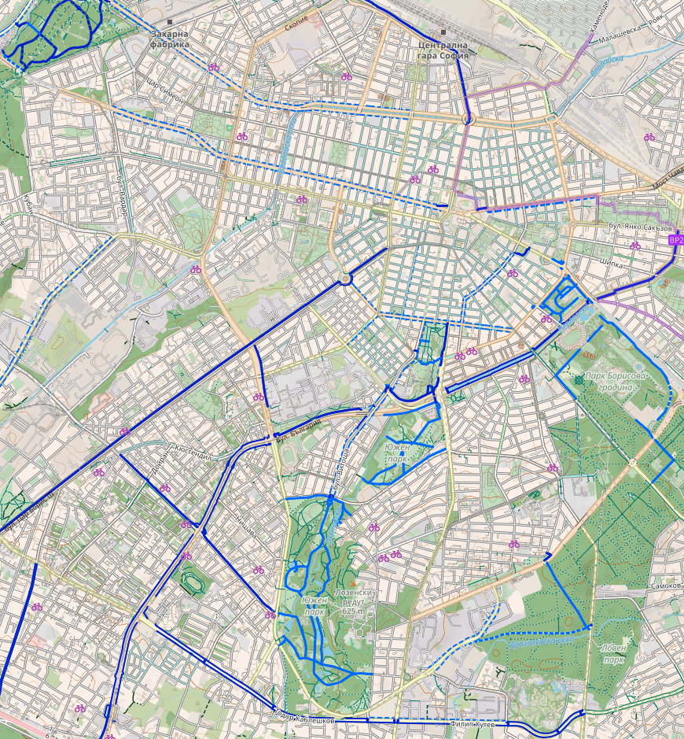
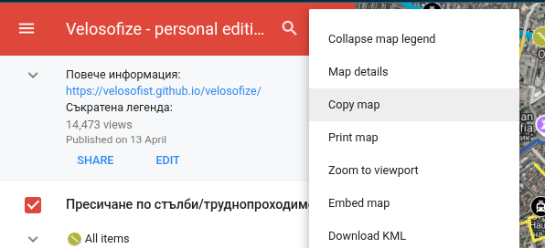

[**🇬🇧 For the english version click here.🇬🇧**](/velosofize/en/alternatives.html)

**Съдържание**

- [CyclOSM](#cyclosm)
- [Български проекти и НПО-та в сферата](#български-проекти-и-нпо-та-в-сферата)
  - [Sofenhagen](#sofenhagen)
  - [Велоеволюция (velobg.org)](#велоеволюция-velobgorg)
    - [Интеркативна карта](#интеркативна-карта)
  - [Zerowastesofia](#zerowastesofia)
    - [Интеркативна карта](#интеркативна-карта-1)
- [Strava heatmap](#strava-heatmap)
- [Komoot](#komoot)
- [Копиране на картата за собствени промени](#копиране-на-картата-за-собствени-промени)

# CyclOSM

[CyclOSM]([cyclosm.org](https://www.cyclosm.org/#map=8/42.604/25.620/cyclosm)) се основава на open-source проект, наречен OpenStreetMap, и изглежда има най-добро покритие на официалните велоалеи в България и международните маршрути. Той обаче **не** е достъпен чрез различните услуги на Google и следователно не съвпада с целите на този проект, които включват да е достъпен на възможно най-широко достъпен софтуер, който повечето български мобилни потребители вече имат и разбират. Освен това изглежда, че не поддържа сателитни изображения, Street и 3D изглед, които са полезни при планирането на маршрути. Все пак CyclOSM е добър ресурс, за който си струва да се допринесе, и със сигурност е по-лесно откриваем за чужденци.
CyclOSM се фокусира върху **по-обективен подход към велосипедните маршрути**, тъй като има за цел да документира съществуващата инфраструктура за велосипеди, а не да отразява субективните мнения на допринасящите към картата.
Може да се използва и през мобилни приложения:
[OSMAnd](https://osmand.net/), [All-In-One Offline Maps](https://play.google.com/store/apps/details?id=net.psyberia.offlinemaps) or [AlpineQuest Rando GPS](https://alpinequest.net/), [OpenMultiMaps](https://framagit.org/tom79/openmaps).

# Български проекти и НПО-та в сферата

## [Sofenhagen](https://sofenhagen.com) 

Sofenhagen е проект разпространяващ информация, събития и карта свързани с колоезденето в София.
Имат карта с маршрути в западна София, която е добро допълнение към маршрутите, включени във "Velosofize personal edition".

## [Велоеволюция (velobg.org)](https://velobg.org/infrastructure/bikelines-sofia)

Велоеволюция беше от решаващо значение за създаването на настоящия проект, тъй като [Velosofize personal edition](/velosofize/bg/index.html) започна като копие за лично ползване на тяхната карта с официални велоалеи в София. Изглежда обаче, че в момента не поддържат активно съдържанието на картата.

### Интеркативна карта

(⭐) Запази в Google Maps

<iframe src="https://www.google.com/maps/d/embed?mid=1yKOlErvOsb1zR2fou8wKUXaN9tI&ehbc=2E312F" width="500" height="400"></iframe>

## [Zerowastesofia](https://zerowastesofia.com/watermap/)

Колаборативен проект за документиране на чешмите и заведенията, които ще напълнят бутилката Ви безплатно.
Имат приложения за [Android](https://play.google.com/store/apps/details?id=com.epicmillennium.cheshmap&pli=1) и [iOS](https://apps.apple.com/bg/app/%D1%87%D0%B5%D1%88%D0%BC%D0%B8%D1%82%D0%B5-%D0%B2-%D0%B1%D1%8A%D0%BB%D0%B3%D0%B0%D1%80%D0%B8%D1%8F/id6741713970), както и карти за София и цяла България с допълнителна информация.

### Интеркативна карта

(⭐) Запази в Google Maps

<iframe src="https://www.google.com/maps/d/embed?mid=1s1SiRpB38OK8MYMPQGTm1WQ3dK2XPfg&ehbc=2E312F" width="500" height="400"></iframe>

# Strava heatmap

[Страва](https://www.strava.com/maps/global-heatmap?sport=Ride&style=standard&terrain=false&labels=true&poi=true&cPhotos=true&gColor=mobileblue&gOpacity=100#7.64/42.856/25.244) е много добра алтернатива, имайки предвид огромното им количество данни, събрани от потребители, които си проследяват или качват маршрутите от тренировки в приложението. Траекториите на всички колоездачи, минали през определено място, се наслагват, за да осветят дадени пътища, алеи и т.н. Така всеки дава своя "глас" за дадени маршрути, без нуждата да се въвеждат на ръка. Бързо проличават маршрути, които човек не би открил по случайност.
На картата им излизат също:

- Велоалеи
- Обществени чешми
- Магазини за части за колела и сервизи

Недостатък е, че според мен има известен bias в полза на големи булеварди, които често не са по-безопасни, удобни или приятни за каране в сравнение с паралелни на тях квартални улички, но са очевидният избор за транзитно преминаващи колоездачи, които не познават района, или за много напреднали/смели колоездачи.
Също така много от функционалностите му са платени (heatmap се използва безплатно, макар и с ограничения).

# [Komoot](https://www.komoot.com/)

# Копиране на картата за собствени промени

Копиране на картата в личния Ви Google Drive, за да правите промени по собствено копие:

