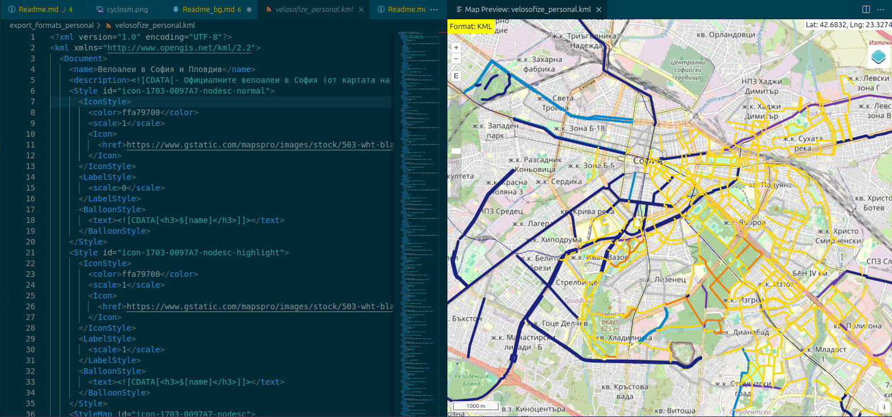

**Table of contents:**

- [Contributing through Github](#contributing-through-github)
  - [VSCode](#vscode)
  - [Who is the map for?](#who-is-the-map-for)
  - [Review process](#review-process)
- [Format conversion](#format-conversion)
  - [KMZ -\> KML](#kmz---kml)
  - [KML -\> geoJson](#kml---geojson)

More details will be published on this page once enough potential contributors have shown interest. For now it serves as a basic concept of what's upcoming.
Reach out at <velosofize@gmail.com> if you're interested in contributing in the future.

# Contributing through Github

The work in Github aims to ensure that a relatively transparent and trustworthy process to suggest and make changes to the map is followed.
The plan is to collect suggestions for new features on the map by users from Google Forms and attached maps and to document their approval process through pull requests, where an approver needs to prove that they visited the marked locations and routes. Though this will slow down updates to the map and may seem pedantic, it aims to ensure that certain standards are applied to all newly added routes.

In planning about how to organize this project beyond its central component - the [Google My Maps map](/velosofize/en/index.html) - I came across other ways to view and edit copies of the map and other projects that one can contribute to.
The map can be presented in text format (.kml) that can be modified with scripts.

## VSCode

- [Install Visual Studio Code.](https://code.visualstudio.com/) Other text editors could also be used, as the critical thing is to just use git for version control and traceablity. If you know what you're doing, feel free. However, having a similar workspace between most contributors would make work easier and would help set some standards for the documentation.

- Clone this repository. This means you'll have a local copy of the project and can start contributing:

For Windows: [Install Git bash](https://git-scm.com/downloads/win).

```bash
cd your_desired_directory
git clone https://github.com/velosofist/velosofize.git
```

- In VSCode go to **File -> Open folder** and choose the repository's directory.
- Go to the extensions tab and search for " @recommended ".
- Install all recommended extensions you're comfortable with. These will help visualize maps from .kml and .geojson files, help you write documentation and make everything more readable.
- Take a second to look through the extensions to get a basic idea of what they're used for and how.
- [Learn some basic Git.](https://daily.dev/blog/contributing-to-open-source-github-a-beginners-guide#:~:text=Learn%20how%20to%20contribute%20to%20open%20source%20GitHub,and%20GitHub%2C%20find%20projects%2C%20make%20contributions%2C%20and%20more.)
- Start contributing by using the Source control tab in VSCode.



## Who is the map for?

Assuming a certain profile for a user of this project might be helpful in determining its goals and the criteria applied to accepting and categorizing routes in the city.
Assume the following when reviewing a request - The cyclist who will be using this is:

- 18+ and of average ablility to judge the situation on the road.
- A casual cyclist
  - Just trying to get to work or university in the city.
  - Just trying to enjoy some time in nature outside the city (past the ring road or in the big parks).
- Riding a fairly cheap mountain bike without specialized gear.

## Review process

# Format conversion

## KMZ -> KML

KMZ is simply an archive containing the KML file, so:

```bash
sudo apt install unzip
unzip your_map.kmz
```

## KML -> geoJson

[mapbox/togeojson](https://github.com/mapbox/togeojson)

Installation and use on Linux:

```bash
npm install -g @mapbox/togeojson
togeojson your_map.kml > your_map.geojson
```
