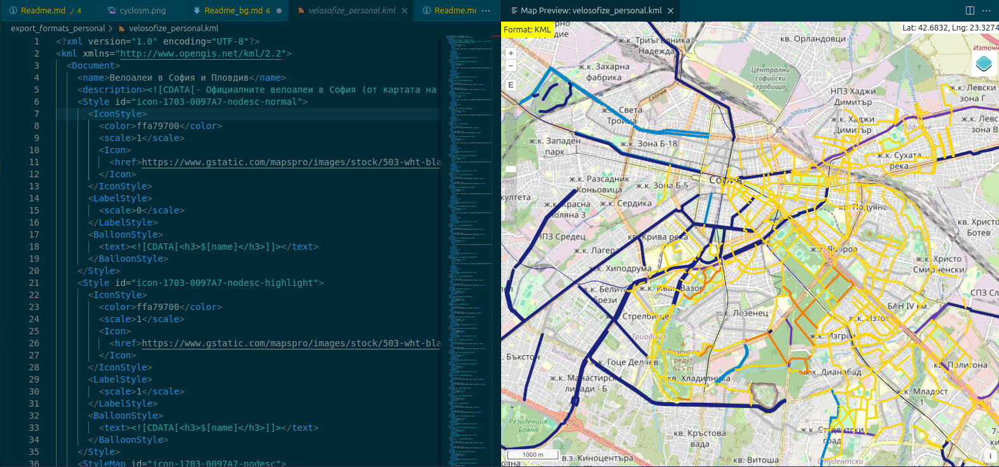

# For contributors

- [For contributors](#for-contributors)
  - [Contributing through Github](#contributing-through-github)
    - [VSCode](#vscode)
    - [Who is the map for?](#who-is-the-map-for)
    - [Review process](#review-process)
  - [Alternatives (How else can I help?)](#alternatives-how-else-can-i-help)
    - [CyclOSM](#cyclosm)
    - [Bulgarian biking-oriented NGOs](#bulgarian-biking-oriented-ngos)
  - [Format conversion](#format-conversion)
    - [KMZ -\> KML](#kmz---kml)
    - [KML -\> geoJson](#kml---geojson)

## Contributing through Github

The work in Github aims to ensure that a relatively transparent and trustworthy process to suggest and make changes to the map is followed.
The plan is to collect suggestions for new features on the map by users from Google Forms and attached maps and to document their approval process through pull requests, where an approver needs to prove that they visited the marked locations and routes. Though this will slow down updates to the map and may seem pedantic, it aims to ensure that certain standards are applied to all newly added routes.

In planning about how to organize this project beyond its central component - the [Google My Maps map]() - I came across other ways to view and edit copies of the map and other projects that one can contribute to.
The map can be presented in text format (.kml) that can be modified with scripts.

### VSCode

- [Install Visual Studio Code.](https://code.visualstudio.com/) Other text editors could also be used, as the critical thing is to just use git for version control and traceablity. If you know what you're doing, feel free. However, having a similar workspace between most contributors would make work easier and would help set some standards for the documentation.

- Clone this repository. This means you'll have a local copy of the project and can start contributing:

[Install Git bash (if on Windows)](https://git-scm.com/downloads/win)

```bash
cd your_desired_directory
git clone https://github.com/velosofist/velosofize.git
```

- In VSCode go to **File -> Open folder** and choose a directory to clone the repository into.
- Go to the extensions tab and search for " @recommended ".
- Install all recommended extensions you're comfortable with. These will help visualize maps from .kml and .geojson files, help you write documentation and make everything more readable.
- Take a second to look through the extensions to get a basic idea of what they're used for and how.
- [Learn some basic Git.](https://daily.dev/blog/contributing-to-open-source-github-a-beginners-guide#:~:text=Learn%20how%20to%20contribute%20to%20open%20source%20GitHub,and%20GitHub%2C%20find%20projects%2C%20make%20contributions%2C%20and%20more.)
- Start contributing by using the Source control tab in VSCode.



### Who is the map for?

Assuming a certain profile for a user of this project might be helpful in determining its goals and the criteria applied to accepting and categorizing routes in the city.
Assume the following when reviewing a request - The cyclist whoĺl be using this is:

- 18+ and of average ablility to be aware of and judge the situation on the road.
- A casual cyclist
  - Just trying to get to work or university in the city
  - Just trying to enjoy some nature outside of the city (past the ring road or in the big parks)
- Riding a fairly cheap mountain bike without much gear

### Review process

## Alternatives (How else can I help?)

### CyclOSM

[CyclOSM](cyclosm.org) is based on an open-source project called OpenStreetMap and seems to have the best coverage of official bike lanes in Bulgaria and international routes. It is, however, **not** accessible through Google's various services and is therefore not equivalent to the goals of this current project, which aims to be as widely available as possible on software that most Bulgarian mobile users already have and understand. Furthermore, it doesn't seem to support satellite imagery, Street and 3D view, which are very helpful when planning a route. It is still a great resource worth contributing to and is easier to find by foreigners.
CyclOSM focuses on a **more objective approach to cycling routes**, as it aims to document existing dedicated infrastructure and not reflect subjective opinions of contributors.
Some excerpts from their about page:

"CyclOSM is a bicycle-oriented map built on top of [OpenStreetMap](openstreetmap.org) data. It aims at providing a beautiful and practical map for cyclists, no matter their cycling habits or abilities.
In urban areas, it renders the main different types of cycle tracks and lanes, on each side of the road, for helping you draw your bike to work route. It also features essential POIs as well as bicycle parking spots or spots shared with motorbikes, specific infrastructure (elevators / ramps), road speeds or surfaces to avoid streets with pavings, bumpers and bike boxes, etc.
The same map also lets you visualize main bicycle touring routes as well as essential POIs when touring (emergency services, shelters, tourism, shops).
The maps are an iterative ongoing work-in-progress and everyone is welcome to contribute editing the OpenStreetMap data if you spot inaccuracies.
CyclOSM is built on open-source and free software. The source code is available at Github and we welcome contributions!. Our tile server infrastructure is provided by OpenStreetMap-France, many thanks to them for their support!
The map is available by default in the following smartphone applications:
[OSMAnd](https://osmand.net/), [All-In-One Offline Maps](https://play.google.com/store/apps/details?id=net.psyberia.offlinemaps) or [AlpineQuest Rando GPS](https://alpinequest.net/) and [OpenMultiMaps](https://framagit.org/tom79/openmaps)."

### Bulgarian biking-oriented NGOs

[Велоеволюция](https://velobg.org/infrastructure/bikelines-sofia) and [Sofenhagen](sofenhagen.com) are two NGOs that have published information, events and maps throughout the years, which the users of this project will surely find useful.
Велоеволюция in particular was critical for the creation of velosofize, as the first draft of the map was largely based on their own map of official bike lanes in Sofia. They don't, however, seem to be actively maintaining their resources currently.
Sofenhagen has a map with many routes in the west of Sofia, which is a good complement to the routes included in the "personal edition" of the velosofize map.

## Format conversion

### KMZ -> KML

KMZ is simply an archive containing the KML file, so:

```bash
sudo apt install unzip
unzip your_map.kmz
```

### KML -> geoJson

[mapbox/togeojson](https://github.com/mapbox/togeojson)

Installation and use on Linux:

```bash
npm install -g @mapbox/togeojson
togeojson your_map.kml > your_map.geojson
```
